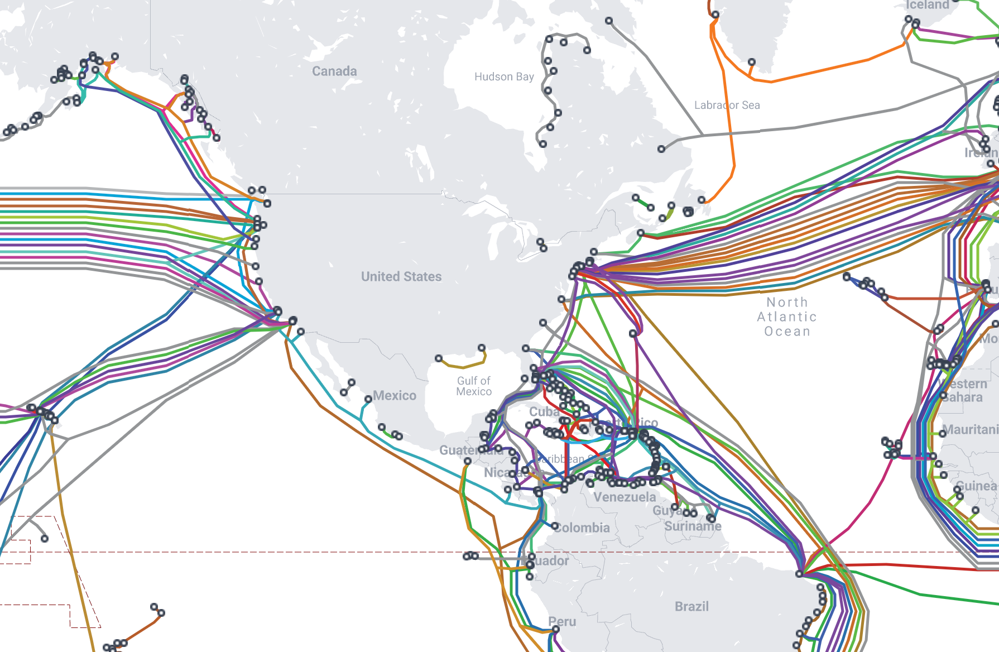
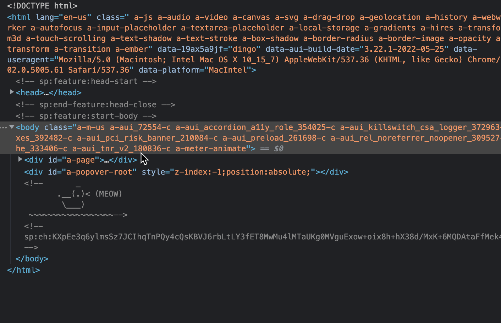
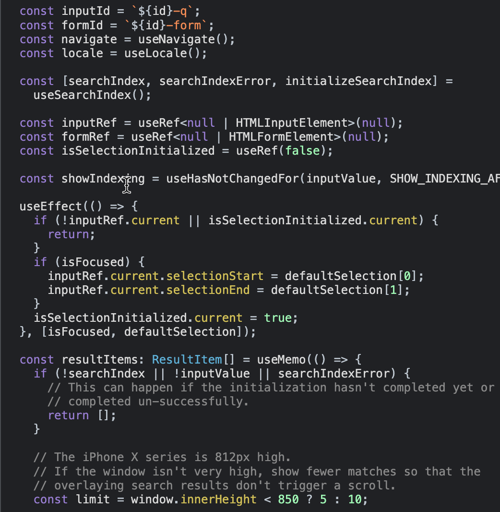
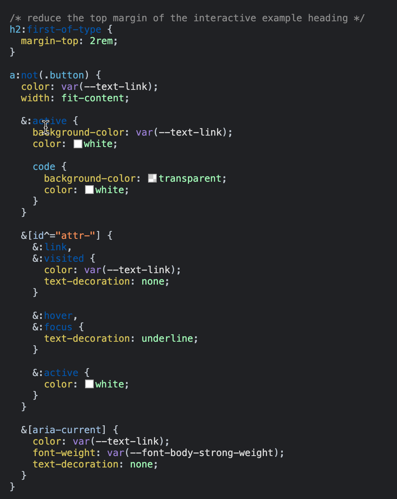

# teals-webDev-intro
A quick, one-day introduction to web development


## 1. T H E  |  I N T E R N E T


The internet and the "web" are so much more then the apps and websites you use. 

Let's take a look at this diagram


1. "The internet" is just someone else's computer. Every thing you get on the internet has to come from somewhere. This can sometimes be called a "host".

2. Data from a host has to travel over some medium. This can be electricity or light through a cable, or radio waves.




3. Data has to be routed from one place to another. This is done by DNS servers, specialized computers that maintain a list of domain name-IP address mappings. Imagine trying to store all of the addresses of the entire internet! How do you think this works? For reference, there are 173.4 million .com addresses. 

> Short history bit, the internet was close to running out of IP (v4) addresses [see here](https://www.datacenterdynamics.com/en/opinions/the-ipv4-run-out-one-year-on/)! There are 4,294,967,296 addresses available in IPv4. The new protocol, IPv6 allows for 340 trillion trillion trillion IP addresses (3.4 x 10^38). 

4. From DNS, data can reach your computer. That's where information is re-assembled, code is run, and you can play Angry Birds.

During the days of Web 1.0, people and companies hosted their own websites and services. Most people think of this era as static content, stuff that doesn't change. Web 2.0 was a paradigm shift -- websites moved to cloud providers and code added a lot more interactivity. Think Google, Amazon Web Services and Microsoft Azure. Web3 is looking to shift the paradigm again, where code is hosted on a distributed blockchain!

But enough background information. Let's talk about the stuff we'll use.


## 2. The language of the web 

### 2.a. HTML

**HTML** tags are the nouns of the internet... They are the things on the page.

You'll know HTML tags because they always start and end with an alligator bracket. Some examples:

```html
<html>
  <body>
    <h1>Dave is cool :)</h1>
  </body>
</html>
```

Here's a quick snapshot of the Amazon.com homepage. It looks like they hid a little easter egg for us.



### 2.b. Javascript

**Javascript** scripts are the verbs. They create actions and interactivity.

An important note...

# Javascript != Java

Javascript was created by Brendan Eich in 1995. It was written in 10 days and its early implementations had poor reputations because of it's lack of types and sometimes inconsistent behavior.

It's now one of the world's most popular _scripting_ languages, being used in both web browsers and backend services. And it's been improved quite a bit! See: Typescript, Node.js. [Even NASA is using Javascript in space!](https://openjsf.org/wp-content/uploads/sites/84/2020/02/Case_Study-Node.js-NASA.pdf) 

[More history of Javascript here](https://launchschool.com/books/javascript/read/introduction)



### 2.c. CSS

**CSS** styles are the adjectives. They describe how things look and feel.



### 2.d. DO try this at home...

Unfortunately, we can't use the browser console on your computers because of the school's security policies. Let me show you a few things you can do...

1. Change HTML content

2. Get data

```js
Array.from(document.querySelectorAll('span')).map(x => x.textContent)
```

3. Change styles

4. ADVANCED -- Inspect network requests, very useful for hacking

## 3. Try it yourself!

https://jsconsole.com/

https://codesandbox.io/s/focused-villani-2x6dk3

Finished product: https://codesandbox.io/s/dawn-waterfall-pogi94

## 4. Additional resources

### MDN Docs

The Mozilla Developer Network is put together by the folks who build Firefox. They have comprehensive docs for all things web.

https://developer.mozilla.org/en-US/

### YouTube

Here's a full code course on Javascript from freeCodeCamp: https://www.youtube.com/watch?v=PkZNo7MFNFg

HTML Tutorial for Beginners: HTML Crash Course https://www.youtube.com/watch?v=qz0aGYrrlhU

CSS tutorial from freeCodeCamp: https://www.youtube.com/watch?v=1Rs2ND1ryYc

There's a lot more! Search for what you'd like to learn on YouTube or let me know if you're interested in a particular topic.
